# Laporan Praktikum Brute Force Divide Conquer 2

## Belajar Sisip Gambar

## Latihan Brute Force
Class MinMax
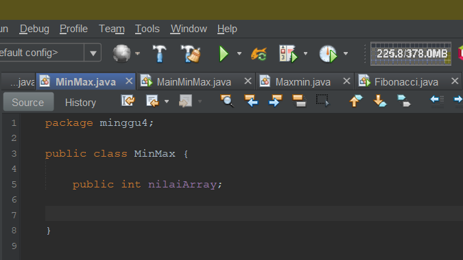
Main Brute Force
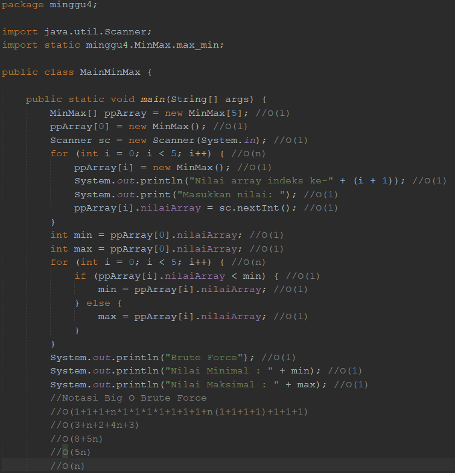

## Latihan Divide Conquer
Class MaxMin
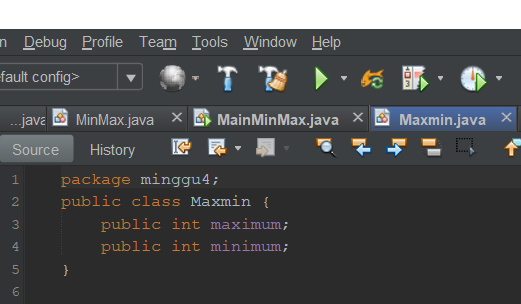
Class MinMax
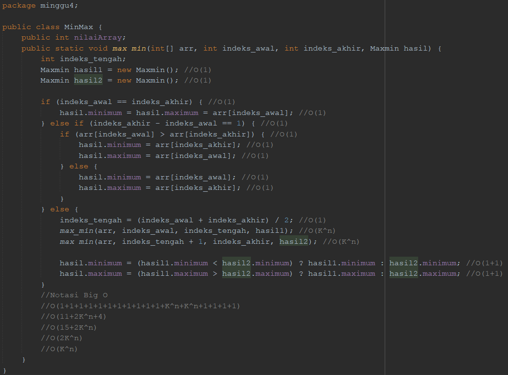
Main Divide and Conquer

## Jawaban Pertanyaan
Hasil Input Array Praktikum 1
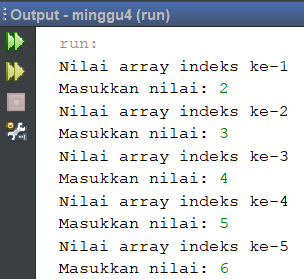

Modifikasi nilai maksimal dan minimal terpisah dari main algoritma brute force
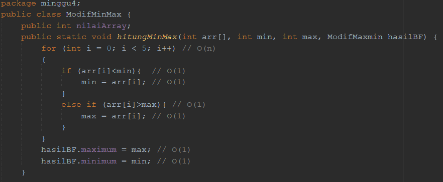

## Tugas Praktikum
Notasi Big O Brute Force

Notasi Big O Divide and Conquer

Notasi Big O Fibonacci Brute Force
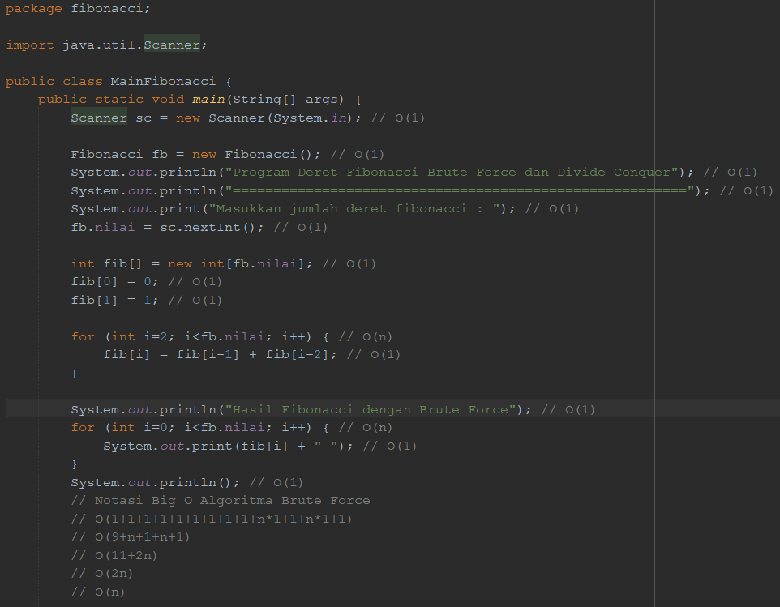

Notasi Big O Fibonacci Divide and Conquer
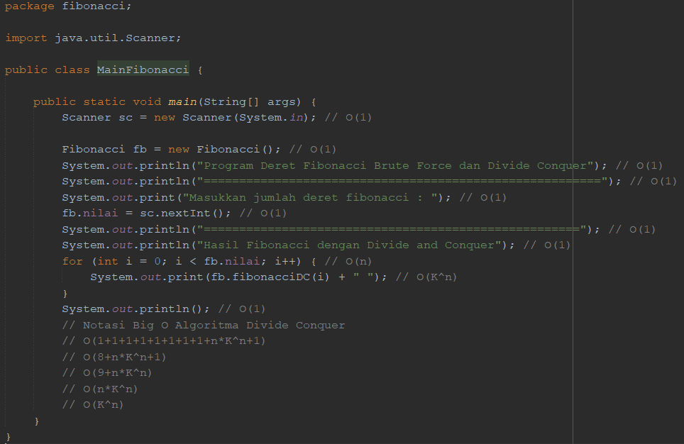

Notasi Big O Faktorial Brute Force
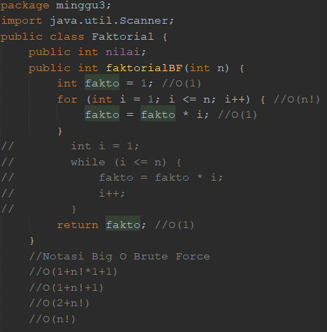
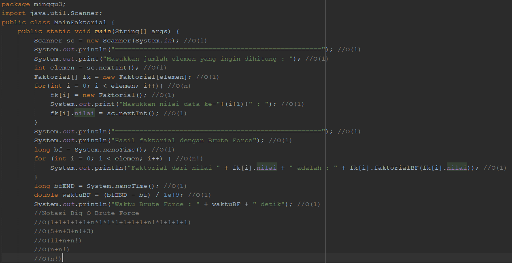

Notasi Big O Faktorial Divide and Conquer
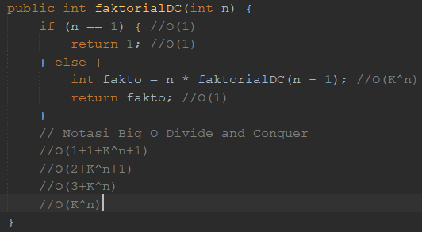
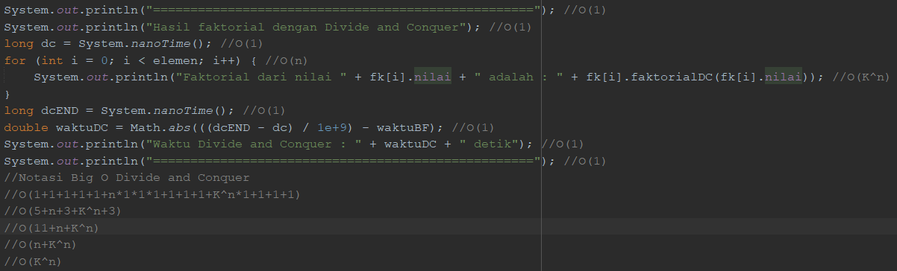